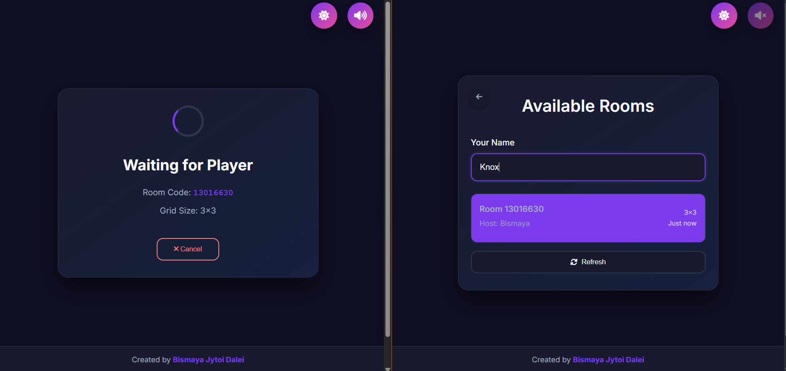
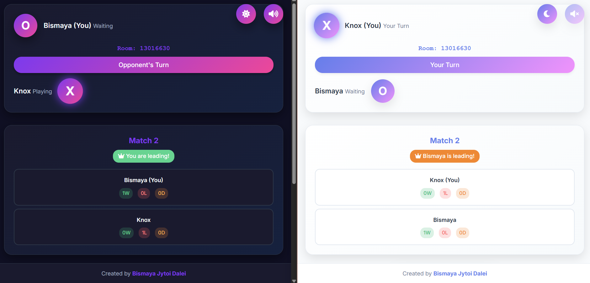

# Full-Stack Multiplayer Tic Tac Toe Game ✘ Ｏ


A real-time multiplayer Tic Tac Toe game built with Flask-SocketIO backend and vanilla JavaScript frontend.

## 🎮 Features

- **Real-time multiplayer gameplay** using WebSockets
- **Customizable grid sizes** (3x3, 4x4, 5x5, etc.)
- **Modern responsive UI** with dark/light theme toggle
- **Room-based matchmaking** system
- **Audio feedback** and visual effects
- **Session scoring** with match history
- **Symbol swapping** between matches

## 📁 Project Structure

```
multiplayer-tic-tac-toe/
├── backend/
│   ├── app.py               # Main Flask-SocketIO server
│   ├── game_logic.py        # Core game logic and room management
│   ├── requirements.txt     # Python dependencies
│   └── runtime.txt          # Python version specification
├── frontend/
│   ├── index.html           # Main HTML file
│   ├── style.css            # Responsive CSS styles
│   ├── script.js            # Game client logic
│   └── assets/
│       ├── icon/            # App icons and favicon
│       └── sfx/             # Sound effects
├── package.json             # NPM configuration
└── README.md                # Project documentation
```

## 📺 Previews




## 🚀 Getting Started

### Prerequisites
- Python 3.8+
- Node.js 14+ (for development server)
- Modern web browser with WebSocket support

### Local Development

#### Backend Setup
```bash
cd backend
pip install -r requirements.txt
python app.py
```

#### Frontend Setup

#### Install dependencies
```bash
npm install
```
##### Start development server
```bash
npm run dev
```

### Production Deployment

Play it [here](https://multiplayer-tic-tac-toe-by-bismya.onrender.com)

**Environment Variables:**
- `PORT`: Server port (auto-set by hosting platform)
- `SECRET_KEY`: Flask secret key for sessions
- `FLASK_ENV`: Set to `production` for production

## 🎮 How to Play

1. **Create or Join Room**: Start a new game or join an existing room
2. **Choose Grid Size**: Select from 3x3 to larger grids
3. **Take Turns**: Players alternate placing X and O marks
4. **Win Condition**: Align your symbols horizontally, vertically, or diagonally
5. **Play Multiple Rounds**: Symbols swap between matches automatically

## 🛠️ Technology Stack

- **Backend**: Python, Flask, Flask-SocketIO, Flask-CORS
- **Frontend**: HTML5, CSS3, Vanilla JavaScript
- **Real-time Communication**: Socket.IO
- **Styling**: Custom CSS with CSS Grid and Flexbox
- **Audio**: Web Audio API

## 📱 Browser Compatibility

- ✅ Chrome 60+
- ✅ Firefox 55+
- ✅ Safari 12+
- ✅ Edge 79+

## 🤝 Contributing

Contributions are welcome! Please feel free to submit a Pull Request.

## 📄 License

This project is licensed under the MIT License - see the [LICENSE](LICENSE) file for details.

## 👨‍💻 Author

**Bismaya Jyoti Dalei**

- GitHub: [@dukebismaya](https://github.com/dukebismaya)
- Email: bismayajd@gmail.com

## 🙏 Acknowledgments

- Socket.IO for real-time communication
- Flask community for excellent documentation
- Font Awesome for icons
- Pixabay for sfx